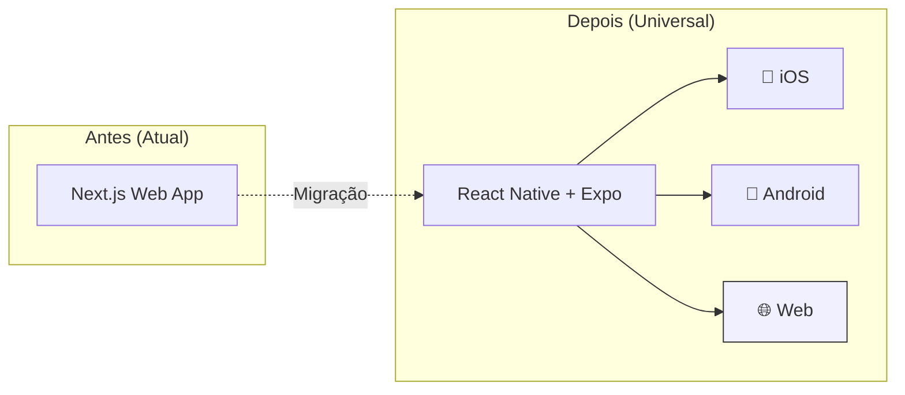
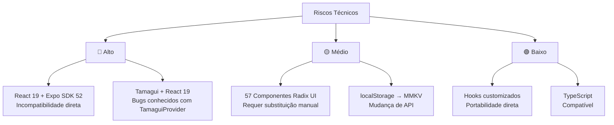
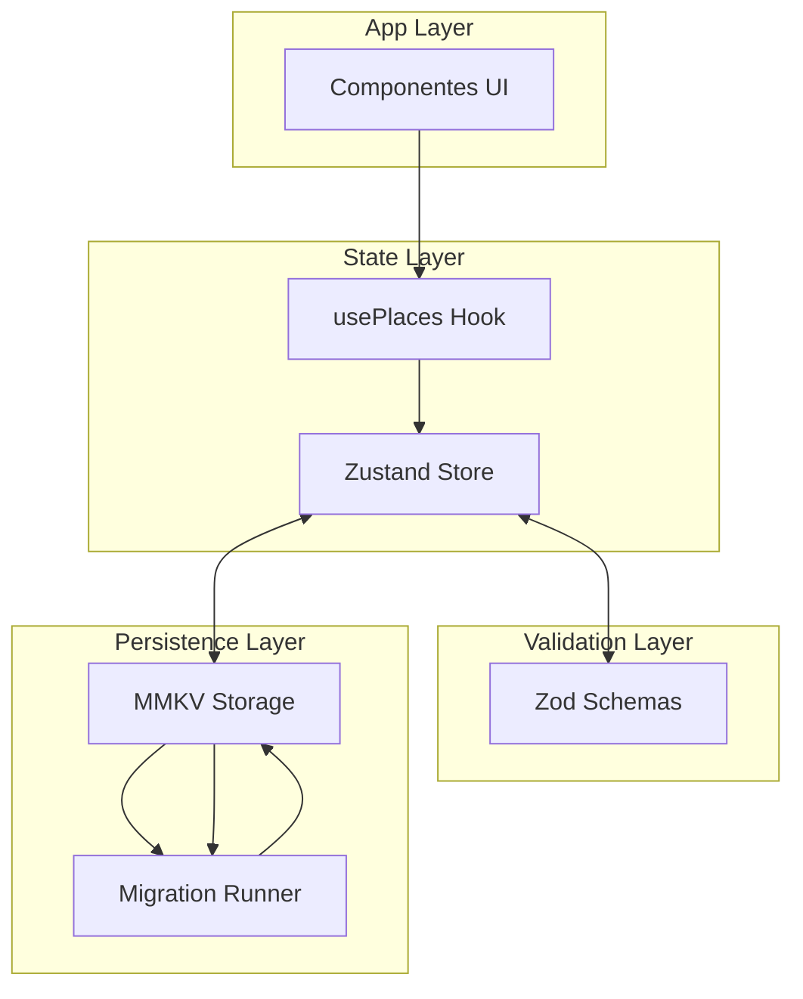
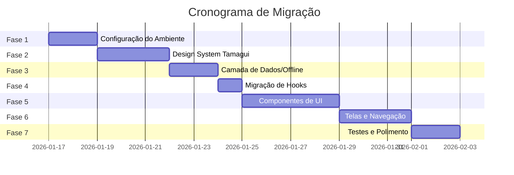

# Estratégia de Migração: Pinpoint Travel App → Universal App

## Resumo Executivo

### Objetivo da Migração

Substituir o projeto **Next.js web** por um **App Universal** construído com React Native + Expo, que será a versão produtiva para **todas as plataformas**:



> [!IMPORTANT]
> **Decisão Estratégica**: O projeto React Native será a **única base de código** para web e mobile. O projeto Next.js atual será descontinuado após a migração.

### Visão Geral do Projeto Atual (Legado)

O **Pinpoint Travel App** atual é uma aplicação web construída com:
- **Next.js 16** (App Router) com React 19
- **Tailwind CSS 4** para estilização
- **57 componentes Radix UI** (shadcn/ui)
- **localStorage** para persistência de dados

#### Pontos Positivos para Migração
| Aspecto | Status | Impacto |
|---------|--------|---------|
| Server Actions | ❌ Não utilizado | ✅ Simplifica migração |
| API Routes | ❌ Não utilizado | ✅ Simplifica migração |
| Zod Schemas | ❌ Não utilizado | ⚠️ Precisará ser criado do zero |
| Lógica de negócio | 100% Client-side | ✅ Altamente portável |

---

### Análise de Riscos Técnicos



> [!NOTE]
> **Decisão Confirmada: Expo SDK 52 + React 18.3.1**  
> - Prioridade: **Estabilidade** sobre recursos mais novos
> - Expo SDK 52 com React Native 0.76 e React 18.3.1
> - Tamagui totalmente compatível nesta configuração
> - Migração para Expo SDK 53 + React 19 quando estabilizado

### Códigos Incompatíveis com Mobile

| Código/API | Localização | Estratégia de Desacoplamento |
|------------|-------------|------------------------------|
| `localStorage` | [use-places.ts](file:///Users/matheus/dev/pinpoint-travel-app/hooks/use-places.ts) | Substituir por MMKV |
| `navigator.clipboard` | [place-card.tsx](file:///Users/matheus/dev/pinpoint-travel-app/components/place-card.tsx#L22-L29) | Usar `expo-clipboard` |
| `window.open()` | [place-card.tsx](file:///Users/matheus/dev/pinpoint-travel-app/components/place-card.tsx#L32-L37) | Usar `expo-linking` |
| `crypto.randomUUID()` | [use-places.ts](file:///Users/matheus/dev/pinpoint-travel-app/hooks/use-places.ts#L41) | Usar `uuid` ou `expo-crypto` |

---

## Estratégia de Persistência de Dados (Offline-First + Universal)

### Recomendação: MMKV + Schema Versionado + Web Fallback

Para o app universal, a estratégia de storage precisa funcionar em **todas as plataformas**:

| Plataforma | Storage | Fallback |
|------------|---------|----------|
| **iOS** | MMKV | - |
| **Android** | MMKV | - |
| **Web** | localStorage | MMKV não suporta web |

| Fase | Stack | Quando Usar |
|------|-------|-------------|
| **Atual** | MMKV + localStorage fallback + Zod + Migrations | Desenvolvimento inicial, offline-first |
| **Futuro** | + Supabase/Firebase | Quando precisar sync multi-device |
| **Escala** | + WatermelonDB | Se dados locais ultrapassarem 10k registros |

#### Bibliotecas Escolhidas

| Biblioteca | Uso | Plataforma |
|------------|-----|------------|
| **react-native-mmkv** | Storage nativo | iOS, Android |
| **localStorage** | Storage web | Web (fallback) |
| **Zod** | Validação de schemas | Universal |
| **zustand** | Estado global | Universal |

### Storage Universal

```typescript
// lib/storage/universal-storage.ts
import { Platform } from 'react-native'

// Tipo comum para todas as plataformas
interface StorageAdapter {
  getString: (key: string) => string | null | undefined
  set: (key: string, value: string) => void
  delete: (key: string) => void
  contains: (key: string) => boolean
}

const createStorage = (): StorageAdapter => {
  if (Platform.OS === 'web') {
    // Web: usa localStorage
    return {
      getString: (key) => localStorage.getItem(key),
      set: (key, value) => localStorage.setItem(key, value),
      delete: (key) => localStorage.removeItem(key),
      contains: (key) => localStorage.getItem(key) !== null,
    }
  }
  
  // Native: usa MMKV
  const { MMKV } = require('react-native-mmkv')
  const mmkv = new MMKV()
  return {
    getString: (key) => mmkv.getString(key),
    set: (key, value) => mmkv.set(key, value),
    delete: (key) => mmkv.delete(key),
    contains: (key) => mmkv.contains(key),
  }
}

export const storage = createStorage()
```

### Sistema de Migrations

Para garantir evolução segura do schema sem perda de dados:

```typescript
// lib/storage/migrations.ts

export const CURRENT_SCHEMA_VERSION = 1

export interface StorageSchema {
  version: number
  places: Place[]
  settings: AppSettings
}

// Registro de migrations
const migrations: Record<number, (data: unknown) => unknown> = {
  // v0 -> v1: Adiciona campo 'favorite' aos places
  1: (data: { places?: Array<{ id: string }> }) => ({
    ...data,
    places: data.places?.map(place => ({
      ...place,
      favorite: false, // novo campo
    })) ?? [],
  }),
  
  // v1 -> v2: Exemplo futuro - renomeia 'note' para 'notes'
  // 2: (data) => ({
  //   ...data,
  //   places: data.places?.map(place => ({
  //     ...place,
  //     notes: place.note, // renomeia
  //     note: undefined,
  //   })),
  // }),
}

export function migrateStorage(currentData: unknown, fromVersion: number): StorageSchema {
  let data = currentData
  
  for (let v = fromVersion + 1; v <= CURRENT_SCHEMA_VERSION; v++) {
    if (migrations[v]) {
      console.log(`[Migration] Running migration v${v - 1} -> v${v}`)
      data = migrations[v](data)
    }
  }
  
  return {
    ...(data as object),
    version: CURRENT_SCHEMA_VERSION,
  } as StorageSchema
}
```

### Arquitetura de Dados



### Estrutura do Storage

```typescript
// lib/storage/schema.ts
import { z } from 'zod'

export const PlaceSchema = z.object({
  id: z.string().uuid(),
  name: z.string().min(1),
  address: z.string().min(1),
  category: z.enum(['food', 'museum', 'viewpoint', 'hotel', 'shopping', 'transport']),
  note: z.string().optional(),
  favorite: z.boolean().default(false), // pronto para v2
  createdAt: z.number(),
  updatedAt: z.number().optional(),
})

export const AppSettingsSchema = z.object({
  theme: z.enum(['light', 'dark', 'system']).default('system'),
  defaultMapApp: z.enum(['amap', 'apple', 'google']).default('amap'),
  lastSync: z.number().optional(), // preparado para futuro backend
})

export const StorageSchema = z.object({
  version: z.number(),
  places: z.array(PlaceSchema),
  settings: AppSettingsSchema,
})

export type Place = z.infer<typeof PlaceSchema>
export type AppSettings = z.infer<typeof AppSettingsSchema>
export type StorageData = z.infer<typeof StorageSchema>
```

### Preparação para Backend Futuro

Quando decidir adicionar sync com backend, a estrutura já suporta:

```typescript
// Futuro: lib/sync/types.ts
export interface SyncablePlace extends Place {
  _syncStatus: 'synced' | 'pending' | 'conflict'
  _serverVersion?: number
  _localVersion: number
  _deletedAt?: number // soft delete para sync
}

// O migration v2 pode adicionar esses campos
// sem quebrar dados existentes
```

> [!TIP]
> **Caminho de Evolução**
> 1. **Agora**: MMKV + Zod (offline-only, simples)
> 2. **+Backend**: Adicionar Supabase/Firebase com sync queue
> 3. **+Escala**: Migrar dados pesados para WatermelonDB, manter MMKV para settings

---

## Mapeamento de UI: Radix → Tamagui

### Componentes Utilizados no Projeto

| Radix UI (Web) | Tamagui (Mobile) | Notas |
|----------------|------------------|-------|
| `Sheet` (custom) | `Sheet` (@tamagui/sheet) | API similar |
| `DropdownMenu` | `Popover` + `YStack` | Comportamento diferente em mobile |
| `Input` | `Input` (@tamagui/input) | Direto |
| `Textarea` | `TextArea` (@tamagui/text-area) | Direto |
| `Card` | `Card` (@tamagui/card) | Direto |
| `Button` | `Button` (@tamagui/button) | Direto |

### Componentes Radix UI Não Utilizados (Podem ser removidos)

57 componentes estão no projeto, mas apenas ~8 são efetivamente usados. Na migração, instale apenas o necessário.

---

## Gerenciador de Pacotes Recomendado

> [!TIP]
> **Recomendação: yarn (Classic v1.22.x)**
> - Melhor compatibilidade com Expo
> - Suporte nativo a workspaces
> - Mais estável que pnpm no ecossistema React Native

Se preferir consistência com o projeto web, `pnpm` funciona, mas requer configuração adicional (`node-linker=hoisted` no `.npmrc`).

---

## Plano de Migração Faseado



---

### Fase 1: Configuração do Ambiente (2 dias)

#### Tarefas
- [ ] 1.1 Criar projeto Expo com template TypeScript
- [ ] 1.2 Configurar Expo Router (file-based routing)
- [ ] 1.3 Instalar e configurar Tamagui
- [ ] 1.4 Configurar Storage Universal (MMKV + web fallback)
- [ ] 1.5 Configurar builds para iOS, Android e Web

#### Estrutura de Pastas Alvo

```
pinpoint/                       ← Novo repositório (substitui Next.js)
├── app/                        # Expo Router (universal)
│   ├── _layout.tsx             # Root layout
│   ├── index.tsx               # Home screen
│   └── place/
│       └── [id].tsx            # Detalhes do lugar (futura)
├── components/
│   ├── ui/                     # Componentes base Tamagui (universal)
│   └── domain/                 # Componentes de negócio
├── lib/
│   ├── storage/                # Storage universal (MMKV + localStorage)
│   ├── schemas/                # Zod schemas
│   ├── stores/                 # Zustand stores
│   └── constants/              # Categorias, etc.
├── hooks/
│   ├── usePlaces.ts
│   └── useTheme.ts
├── tamagui.config.ts
├── app.json                    # Expo config
└── package.json
```

#### Scripts de Build (package.json)

```json
{
  "scripts": {
    "dev": "expo start",
    "dev:web": "expo start --web",
    "dev:ios": "expo start --ios",
    "dev:android": "expo start --android",
    "build:web": "expo export --platform web",
    "build:ios": "eas build --platform ios",
    "build:android": "eas build --platform android"
  }
}
```

#### Deploy por Plataforma

| Plataforma | Comando | Destino |
|------------|---------|---------|
| **Web** | `npm run build:web` | Vercel, Netlify, ou qualquer static host |
| **iOS** | `eas build --platform ios` | App Store via EAS |
| **Android** | `eas build --platform android` | Play Store via EAS |

---

#### 🤖 Prompt 1.1: Criar Projeto Expo Universal

> **Modelo sugerido**: GPT-4o-mini, Claude Haiku, Gemini Flash

```
Crie um novo projeto Expo Universal (iOS, Android, Web) com as seguintes especificações:
- Nome: pinpoint
- Template: expo-template-blank-typescript
- Expo SDK: 52 (última versão estável)
- Gerenciador de pacotes: yarn

Comando esperado:
npx create-expo-app@latest pinpoint --template expo-template-blank-typescript

Este projeto substituirá completamente o app Next.js existente e será o único 
codebase para web, iOS e Android.

Após criar:
1. Liste a estrutura de pastas gerada
2. Verifique se expo web está instalado: npx expo install react-dom react-native-web @expo/metro-runtime
```

---

#### 🤖 Prompt 1.2: Configurar Expo Router

> **Modelo sugerido**: GPT-4o-mini, Claude Haiku, Gemini Flash

```
No projeto "pinpoint", instale e configure o Expo Router para navegação file-based universal:

1. Instale as dependências:
   - expo-router
   - expo-linking
   - expo-constants
   - expo-status-bar

2. Atualize o package.json com "main": "expo-router/entry"

3. Crie a estrutura de pastas:
   - app/_layout.tsx (root layout)
   - app/index.tsx (home screen placeholder)

4. Configure o app.json com o scheme "pinpoint"

5. Adicione scripts ao package.json:
   - "dev": "expo start"
   - "dev:web": "expo start --web"
   - "dev:ios": "expo start --ios"
   - "dev:android": "expo start --android"
   - "build:web": "expo export --platform web"

Forneça o código completo de cada arquivo criado.
```

---

#### 🤖 Prompt 1.3: Instalar e Configurar Tamagui (Universal)

> **Modelo sugerido**: GPT-4o, Claude Sonnet (requer conhecimento de config)

```
No projeto Expo "pinpoint", instale e configure o Tamagui UI para funcionar em 
iOS, Android e Web:

1. Instale os pacotes necessários:
   - @tamagui/core
   - @tamagui/config
   - @tamagui/sheet
   - @tamagui/lucide-icons
   - react-native-reanimated
   - react-native-safe-area-context

2. Crie o arquivo tamagui.config.ts na raiz do projeto com:
   - Tema light e dark
   - Tokens de cores básicos
   - Configuração de fontes (Inter)

3. Atualize app/_layout.tsx para incluir TamaguiProvider

4. Configure o babel.config.js para incluir o plugin do Tamagui

5. Verifique que o Tamagui compila corretamente para web (CSS otimizado)

Forneça todos os arquivos de configuração completos.
Teste executando: npm run dev:web
```

---

#### 🤖 Prompt 1.4: Configurar Storage Universal

> **Modelo sugerido**: GPT-4o, Claude Sonnet (lógica de plataforma)

```
No projeto "pinpoint", crie um sistema de storage universal que funciona em 
iOS, Android e Web:

1. Instale: react-native-mmkv

2. Crie lib/storage/universal-storage.ts com:
   - Interface StorageAdapter com getString, set, delete, contains
   - Factory function createStorage() que:
     - Retorna wrapper de localStorage para Platform.OS === 'web'
     - Retorna MMKV para iOS e Android
   - Export da instância singleton: storage

3. Crie lib/storage/zustand-adapter.ts:
   - Wrapper compatível com zustand persist middleware
   - Usa the storage universal internamente

4. Teste em web e mobile para garantir funcionamento.

Forneça código completo e pronto para uso.
```

---

### Fase 2: Design System Tamagui (3 dias)

#### Tarefas
- [ ] 2.1 Definir tokens de design (cores, espaçamento, tipografia)
- [ ] 2.2 Criar componente Button customizado
- [ ] 2.3 Criar componente Input customizado
- [ ] 2.4 Criar componente Card customizado

#### Mapeamento de Cores

```typescript
// De Tailwind CSS (globals.css) para Tamagui config
const lightTheme = {
  background: 'hsl(0 0% 100%)',
  foreground: 'hsl(240 10% 3.9%)',
  primary: 'hsl(240 5.9% 10%)',
  primaryForeground: 'hsl(0 0% 98%)',
  secondary: 'hsl(240 4.8% 95.9%)',
  secondaryForeground: 'hsl(240 5.9% 10%)',
  muted: 'hsl(240 4.8% 95.9%)',
  mutedForeground: 'hsl(240 3.8% 46.1%)',
  destructive: 'hsl(0 84.2% 60.2%)',
  border: 'hsl(240 5.9% 90%)',
  card: 'hsl(0 0% 100%)',
  cardForeground: 'hsl(240 10% 3.9%)',
}
```

---

#### 🤖 Prompt 2.1: Definir Tokens de Design

> **Modelo sugerido**: GPT-4o-mini, Claude Haiku, Gemini Flash

```
Atualize o arquivo tamagui.config.ts com os seguintes tokens de design baseados no design system existente:

Cores Light Theme:
- background: hsl(0, 0%, 100%)
- foreground: hsl(240, 10%, 3.9%)
- primary: hsl(240, 5.9%, 10%)
- primaryForeground: hsl(0, 0%, 98%)
- secondary: hsl(240, 4.8%, 95.9%)
- secondaryForeground: hsl(240, 5.9%, 10%)
- muted: hsl(240, 4.8%, 95.9%)
- mutedForeground: hsl(240, 3.8%, 46.1%)
- destructive: hsl(0, 84.2%, 60.2%)
- border: hsl(240, 5.9%, 90%)
- card: hsl(0, 0%, 100%)
- cardForeground: hsl(240, 10%, 3.9%)

Cores Dark Theme:
- background: hsl(240, 10%, 3.9%)
- foreground: hsl(0, 0%, 98%)
- (derivar as demais cores automaticamente)

Espaçamentos: 1-10 ($1 = 4px, $2 = 8px, etc.)

Forneça o tamagui.config.ts completo atualizado.
```

---

#### 🤖 Prompt 2.2: Criar Componente Button

> **Modelo sugerido**: GPT-4o-mini, Claude Haiku, Gemini Flash

```
Crie o componente Button customizado em components/ui/Button.tsx para o projeto Tamagui:

Requisitos:
- Variantes: default, secondary, destructive, ghost
- Tamanhos: sm, md, lg
- Suporte a ícone à esquerda
- Estado de loading com spinner
- Animação de press (scale down)

Use styled() do Tamagui e GetProps para tipagem.
Exporte também as props como ButtonProps.
```

---

#### 🤖 Prompt 2.3: Criar Componente Input

> **Modelo sugerido**: GPT-4o-mini, Claude Haiku, Gemini Flash

```
Crie o componente Input customizado em components/ui/Input.tsx para Tamagui:

Requisitos:
- Suporte a label flutuante (opcional)
- Estado de erro com mensagem
- Ícone à esquerda (opcional)
- Altura de 56px para tap target adequado
- Border radius de 12px
- Focus ring com cor primary

Integre com react-hook-form se possível.
```

---

#### 🤖 Prompt 2.4: Criar Componente Card

> **Modelo sugerido**: GPT-4o-mini, Claude Haiku, Gemini Flash

```
Crie o componente Card customizado em components/ui/Card.tsx:

Requisitos:
- Elevação sutil (shadow)
- Border radius de 16px
- Padding interno de $4
- Hover state (para web) - opcional no mobile
- Composição com Card.Header, Card.Content, Card.Footer
```

### Fase 3: Camada de Dados/Offline (2 dias)

#### Tarefas
- [ ] 3.1 Criar Zod schemas para `Place` e `Category`
- [ ] 3.2 Criar Zustand Store com MMKV
- [ ] 3.3 Validar persistência offline
- [ ] 3.4 Implementar sistema de migrations

#### Schema Zod para Place

```typescript
// lib/schemas/place.schema.ts
import { z } from 'zod'

export const PlaceSchema = z.object({
  id: z.string().uuid(),
  name: z.string().min(1, 'Nome é obrigatório'),
  address: z.string().min(1, 'Endereço é obrigatório'),
  category: z.enum(['food', 'museum', 'viewpoint', 'hotel', 'shopping', 'transport']),
  note: z.string().optional(),
  createdAt: z.number(),
})

export type Place = z.infer<typeof PlaceSchema>

export const CreatePlaceSchema = PlaceSchema.omit({ id: true, createdAt: true })
export type CreatePlace = z.infer<typeof CreatePlaceSchema>
```

---

#### 🤖 Prompt 3.1: Criar Zod Schemas

> **Modelo sugerido**: GPT-4o-mini, Claude Haiku, Gemini Flash

```
Crie os schemas Zod em lib/schemas/:

1. lib/schemas/place.schema.ts:
   - PlaceSchema com id, name, address, category, note (optional), createdAt
   - CreatePlaceSchema (sem id e createdAt)
   - UpdatePlaceSchema (partial, sem id e createdAt)
   - Category como enum literal

2. lib/schemas/category.schema.ts:
   - CategorySchema com id, label, icon
   - CATEGORIES array constante

Exporte types inferidos (Place, CreatePlace, Category).
```

---

#### 🤖 Prompt 3.2: Criar Zustand Store com MMKV

> **Modelo sugerido**: GPT-4o, Claude Sonnet (lógica mais complexa)

```
Crie o store Zustand em lib/stores/places.store.ts:

Requisitos:
1. Use zustand com middleware persist
2. Configure storage customizado usando MMKV (de lib/mmkv.ts)
3. Estado: places (array), isLoading, error
4. Actions: addPlace, deletePlace, updatePlace, loadPlaces
5. Valide dados com Zod antes de persistir
6. Ordene places por createdAt (mais recente primeiro)

Forneça exemplo de uso do store em um componente.
```

---

#### 🤖 Prompt 3.3: Validar Persistência Offline

> **Modelo sugerido**: GPT-4o-mini, Claude Haiku, Gemini Flash

```
Crie um componente de teste em app/test-storage.tsx que:

1. Adiciona 3 lugares de exemplo
2. Mostra os lugares em uma lista
3. Permite deletar lugares
4. Instrui o usuário a fechar e reabrir o app
5. Verifica se os dados persistiram

Use o places.store.ts criado anteriormente.
```

---

#### 🤖 Prompt 3.4: Implementar Sistema de Migrations

> **Modelo sugerido**: GPT-4o, Claude Sonnet (lógica crítica)

```
Crie o sistema de migrations de schema em lib/storage/:

1. lib/storage/migrations.ts:
   - CURRENT_SCHEMA_VERSION constante
   - Interface StorageSchema com version, places, settings
   - Objeto migrations com funções de migração por versão
   - Função migrateStorage(currentData, fromVersion) que aplica migrations

2. lib/storage/index.ts:
   - Função initializeStorage() que:
     a. Lê versão atual do MMKV
     b. Se versão < CURRENT_SCHEMA_VERSION, executa migrations
     c. Valida dados com Zod antes de retornar
     d. Log de cada migration executada

3. Integre com Zustand store:
   - Chamar migrateStorage no carregamento inicial
   - Sempre salvar com version atual

Exemplo de migration:
- v0 → v1: Adiciona campo 'favorite: false' a todos os places

Forneça código completo e testável.
```

---

### Fase 4: Migração de Hooks (1 dia)

#### Tarefas
- [ ] 4.1 Migrar hook usePlaces
- [ ] 4.2 Criar hook useTheme para Tamagui

#### Comparação: Hook Original vs Migrado

````carousel
**Hook Original (Web)**
```typescript
// hooks/use-places.ts (Web)
const STORAGE_KEY = "tripstash_places"

export function usePlaces() {
  const [places, setPlaces] = useState<Place[]>([])
  
  useEffect(() => {
    const stored = localStorage.getItem(STORAGE_KEY)
    if (stored) setPlaces(JSON.parse(stored))
  }, [])
  
  useEffect(() => {
    localStorage.setItem(STORAGE_KEY, JSON.stringify(places))
  }, [places])
  
  // ... CRUD operations
}
```
<!-- slide -->
**Hook Migrado (Mobile)**
```typescript
// lib/stores/places.store.ts (Mobile)
import { create } from 'zustand'
import { persist, createJSONStorage } from 'zustand/middleware'
import { mmkvStorage } from '@/lib/mmkv'

export const usePlacesStore = create(
  persist(
    (set) => ({
      places: [],
      addPlace: (place) => set((state) => ({
        places: [{ ...place, id: uuid(), createdAt: Date.now() }, ...state.places]
      })),
      deletePlace: (id) => set((state) => ({
        places: state.places.filter(p => p.id !== id)
      })),
      updatePlace: (id, updates) => set((state) => ({
        places: state.places.map(p => p.id === id ? { ...p, ...updates } : p)
      })),
    }),
    {
      name: 'places-storage',
      storage: createJSONStorage(() => mmkvStorage),
    }
  )
)
```
````

---

#### 🤖 Prompt 4.1: Migrar Hook usePlaces

> **Modelo sugerido**: GPT-4o-mini, Claude Haiku, Gemini Flash

```
O hook usePlaces original usa useState + localStorage.

Arquivo original: hooks/use-places.ts (projeto web)

Crie hooks/usePlaces.ts para mobile que:
1. Re-exporta seletores do Zustand store
2. Mantém a mesma API externa (places, addPlace, deletePlace, updatePlace)
3. Adiciona helper isLoaded para compatibilidade

Isso permite que os componentes migrem com mudanças mínimas.
```

---

#### 🤖 Prompt 4.2: Criar Hook useTheme para Tamagui

> **Modelo sugerido**: GPT-4o-mini, Claude Haiku, Gemini Flash

```
Crie hooks/useTheme.ts que integra com Tamagui:

Requisitos:
1. Obter tema atual (light/dark) do useTheme do Tamagui
2. Função toggleTheme que altera o tema
3. Persistir preferência de tema no MMKV
4. Respeitar preferência do sistema por padrão

Use o hook useTheme do Tamagui e combine com MMKV para persistência.
```

### Fase 5: Componentes de UI (4 dias)

#### Tarefas
- [ ] 5.1 Criar PlaceCard com Tamagui
- [ ] 5.2 Criar AddPlaceSheet
- [ ] 5.3 Criar EditPlaceSheet
- [ ] 5.4 Criar CategoryFilter
- [ ] 5.5 Criar SearchBar
- [ ] 5.6 Criar EmptyState
- [ ] 5.7 Criar Header

#### Exemplo: PlaceCard Migrado

```typescript
// components/domain/PlaceCard.tsx
import { Card, XStack, YStack, Text, Button } from 'tamagui'
import { Copy, Navigation, MoreVertical } from '@tamagui/lucide-icons'
import * as Clipboard from 'expo-clipboard'
import * as Linking from 'expo-linking'

export function PlaceCard({ place, onDelete, onUpdate }) {
  const copyAddress = async () => {
    await Clipboard.setStringAsync(place.address)
    // Show toast
  }

  const openInAMap = () => {
    const amapUrl = `https://uri.amap.com/search?keyword=${encodeURIComponent(place.address)}&src=pinpoint`
    Linking.openURL(amapUrl)
  }

  return (
    <Card padded elevate>
      <YStack gap="$2">
        <XStack alignItems="center" gap="$2">
          <Text fontSize="$5">{getCategoryIcon(place.category)}</Text>
          <Text fontWeight="bold" fontSize="$5" flex={1} numberOfLines={1}>
            {place.name}
          </Text>
          <Button icon={MoreVertical} chromeless circular />
        </XStack>
        
        <Text color="$gray10" numberOfLines={2}>{place.address}</Text>
        
        {place.note && (
          <Text color="$gray9" fontStyle="italic">💬 {place.note}</Text>
        )}
        
        <XStack gap="$2" marginTop="$2">
          <Button flex={1} icon={Copy} onPress={copyAddress}>Copy</Button>
          <Button flex={1} icon={Navigation} theme="active" onPress={openInAMap}>
            Open AMap
          </Button>
        </XStack>
      </YStack>
    </Card>
  )
}
```

---

#### 🤖 Prompt 5.1: Criar PlaceCard

> **Modelo sugerido**: GPT-4o-mini, Claude Haiku, Gemini Flash

```
Migre o componente PlaceCard.tsx para Tamagui.

Arquivo original: components/place-card.tsx

Requisitos:
1. Use Card, XStack, YStack, Text, Button do Tamagui
2. Substitua navigator.clipboard por expo-clipboard
3. Para "Open AMap", use expo-linking com URL: 
   https://uri.amap.com/search?keyword={address}&src=pinpoint
4. Use ícones do @tamagui/lucide-icons
5. Mantenha as mesmas funcionalidades (copy, open AMap, delete, edit)
6. Adapte o menu de opções para um Sheet ou ActionSheet nativo

Forneça o código completo em components/domain/PlaceCard.tsx
```

---

#### 🤖 Prompt 5.2: Criar AddPlaceSheet

> **Modelo sugerido**: GPT-4o, Claude Sonnet (UI complexa)

```
Migre o componente AddPlaceSheet.tsx para Tamagui Sheet.

Arquivo original: components/add-place-sheet.tsx

Requisitos:
1. Use @tamagui/sheet para o bottom sheet
2. Mantenha os mesmos campos: name, address, category, note
3. Use Input e TextArea do Tamagui
4. Grid de categorias com chips selecionáveis
5. Validação client-side (name e address obrigatórios)
6. Integre com o PlaceSchema do Zod

Forneça o código completo em components/domain/AddPlaceSheet.tsx
```

---

#### 🤖 Prompt 5.3: Criar EditPlaceSheet

> **Modelo sugerido**: GPT-4o-mini, Claude Haiku, Gemini Flash

```
Migre o componente EditPlaceSheet.tsx para Tamagui.

Similar ao AddPlaceSheet, mas:
1. Recebe um place existente como prop
2. Preenche os campos com valores atuais
3. Chama onSave com os updates parciais
4. Botão de save só habilita se houver mudanças

Forneça o código completo em components/domain/EditPlaceSheet.tsx
```

---

#### 🤖 Prompt 5.4: Criar CategoryFilter

> **Modelo sugerido**: GPT-4o-mini, Claude Haiku, Gemini Flash

```
Migre o componente CategoryFilter.tsx para Tamagui.

Arquivo original: components/category-filter.tsx

Requisitos:
1. ScrollView horizontal com chips de categoria
2. Chip "All" no início
3. Indicador visual do chip selecionado
4. Badge com contagem de lugares por categoria
5. Use XStack com overflow scroll

Forneça o código completo em components/domain/CategoryFilter.tsx
```

---

#### 🤖 Prompt 5.5: Criar SearchBar

> **Modelo sugerido**: GPT-4o-mini, Claude Haiku, Gemini Flash

```
Migre o componente SearchBar.tsx para Tamagui.

Arquivo original: components/search-bar.tsx

Requisitos:
1. Input com ícone de busca à esquerda
2. Botão de limpar quando há texto (X à direita)
3. Placeholder "Search places..."
4. Debounce de 300ms no onChange

Forneça o código completo em components/domain/SearchBar.tsx
```

---

#### 🤖 Prompt 5.6: Criar EmptyState

> **Modelo sugerido**: GPT-4o-mini, Claude Haiku, Gemini Flash

```
Migre o componente EmptyState.tsx para Tamagui.

Arquivo original: components/empty-state.tsx

Requisitos:
1. Ilustração/emoji centralizado
2. Título e subtítulo descritivo
3. Variants: no-places, no-results, no-category-results
4. Botão de ação opcional (ex: "Add your first place")

Forneça o código completo em components/domain/EmptyState.tsx
```

---

#### 🤖 Prompt 5.7: Criar Header

> **Modelo sugerido**: GPT-4o-mini, Claude Haiku, Gemini Flash

```
Migre o componente Header.tsx para Tamagui.

Arquivo original: components/header.tsx

Requisitos:
1. Título do app com emoji 📍
2. Badge com contagem de lugares
3. Botão de toggle de tema (sun/moon icon)
4. Safe area insets para notch/status bar
5. Background com blur sutil (opcional)

Forneça o código completo em components/domain/Header.tsx
```

---

### Fase 6: Telas e Navegação (3 dias)

#### Tarefas
- [ ] 6.1 Configurar Root Layout
- [ ] 6.2 Criar Home Screen
- [ ] 6.3 Criar FAB (Floating Action Button)

---

#### 🤖 Prompt 6.1: Configurar Root Layout

> **Modelo sugerido**: GPT-4o, Claude Sonnet (config complexa)

```
Atualize app/_layout.tsx com:

1. TamaguiProvider com tema dinâmico
2. SafeAreaProvider
3. StatusBar configuration
4. Theme persistence (MMKV)
5. Font loading (Inter)
6. Splash screen handling

Forneça o código completo.
```

---

#### 🤖 Prompt 6.2: Criar Home Screen

> **Modelo sugerido**: GPT-4o, Claude Sonnet (integração de componentes)

```
Crie a tela Home completa em app/index.tsx:

Requisitos:
1. Header com toggle de tema e contagem
2. SearchBar
3. CategoryFilter horizontal
4. Lista de PlaceCards (FlatList ou FlashList)
5. EmptyState quando apropriado
6. FAB para adicionar lugar
7. AddPlaceSheet integrado

Combine todos os componentes criados anteriormente.
Forneça o código completo.
```

---

#### 🤖 Prompt 6.3: Criar FAB (Floating Action Button)

> **Modelo sugerido**: GPT-4o-mini, Claude Haiku, Gemini Flash

```
Crie components/ui/FAB.tsx:

Requisitos:
1. Botão circular fixo no canto inferior direito
2. Ícone de "+" centralizado
3. Sombra elevada
4. Animação de press (scale)
5. Safe area aware (não cobrir gesture bar)
6. Cor primary do tema

Use Animated do react-native-reanimated para animações.
```

---

### Fase 7: Testes e Polimento (2 dias)

#### Tarefas
- [ ] 7.1 Testar em todas as plataformas (Web, iOS, Android)
- [ ] 7.2 Testar modo offline (Native) + localStorage persistence (Web)
- [ ] 7.3 Configurar App Icon e Splash
- [ ] 7.4 Otimizar performance da lista

---

#### 🤖 Prompt 7.1: Testar em Todas as Plataformas

> **Modelo sugerido**: GPT-4o-mini, Claude Haiku, Gemini Flash

```
Crie um checklist de validação cross-platform para o app universal:

## Web (npm run dev:web)
- [ ] App carrega sem erros no console
- [ ] Tema light/dark funciona
- [ ] localStorage persiste dados após refresh
- [ ] Todos os componentes renderizam corretamente
- [ ] Navegação funciona (Expo Router)
- [ ] Responsividade em diferentes tamanhos de tela

## iOS (npm run dev:ios)
- [ ] App inicia no Simulator
- [ ] Safe areas respeitadas (notch, home indicator)
- [ ] Gestos de navegação funcionam
- [ ] MMKV persiste dados após fechar app
- [ ] Clipboard funciona (copy address)
- [ ] Linking abre AMap

## Android (npm run dev:android)
- [ ] App inicia no Emulator
- [ ] Botão de voltar funciona corretamente
- [ ] MMKV persiste dados após fechar app
- [ ] Clipboard funciona
- [ ] Linking abre AMap ou browser

Forneça comandos para executar cada teste.
```

---

#### 🤖 Prompt 7.2: Testar Modo Offline

> **Modelo sugerido**: GPT-4o-mini, Claude Haiku, Gemini Flash

```
Crie um checklist de testes manuais para validar o modo offline:

1. Adicionar lugar com internet
2. Desligar internet (modo avião)
3. Verificar que lugares aparecem
4. Adicionar novo lugar offline
5. Editar lugar offline
6. Deletar lugar offline
7. Fechar app completamente
8. Reabrir app (ainda offline)
9. Verificar que todas as mudanças persistiram
10. Religar internet e verificar estabilidade

Forneça instruções detalhadas para executar cada teste.
```

---

#### 🤖 Prompt 7.3: Configurar App Icon e Splash

> **Modelo sugerido**: GPT-4o-mini, Claude Haiku, Gemini Flash

```
Configure o ícone do app e splash screen:

1. Gere ícone usando Expo Image Utils ou ferramenta similar
2. Configure icon no app.json (1024x1024 para iOS, adaptive para Android)
3. Configure splash screen com fundo e logo centralizado
4. Use cores do tema (primary background)
5. Para web, configure favicon.ico

Forneça o app.json atualizado e instruções para gerar assets.
```

---

#### 🤖 Prompt 7.4: Otimizar Performance da Lista

> **Modelo sugerido**: GPT-4o-mini, Claude Haiku, Gemini Flash

```
Otimize a lista de lugares para performance em todas as plataformas:

1. Substitua FlatList por FlashList (@shopify/flash-list)
2. Configure estimatedItemSize
3. Implemente getItemType se houver tipos diferentes
4. Adicione keyExtractor otimizado
5. Memoize PlaceCard com React.memo
6. Use useCallback para handlers
7. Verifique performance em web (virtualização funciona diferente)

Forneça o código otimizado da lista.
```

---

## Verificação Final

### Checklist de Migração Completa (Universal App)

#### ✅ Funcionalidade Core
- [ ] App inicia sem erros em **Web**, **iOS** e **Android**
- [ ] Tema light/dark funciona e persiste em todas as plataformas
- [ ] CRUD de lugares funciona completo
- [ ] Dados persistem após restart (MMKV em native, localStorage em web)

#### ✅ UI/UX
- [ ] Busca filtra corretamente
- [ ] Filtro de categoria funciona
- [ ] Copy address usa clipboard (nativo/web)
- [ ] Open AMap abre corretamente
- [ ] Sheet de adicionar abre/fecha
- [ ] Sheet de editar preenche dados existentes
- [ ] Empty states aparecem corretamente

#### ✅ Platform-Specific
- [ ] **iOS**: Safe areas respeitadas (notch, home indicator)
- [ ] **Android**: Botão voltar funciona
- [ ] **Web**: Responsivo em diferentes telas

#### ✅ Performance
- [ ] Performance suave em listas grandes (50+ itens)
- [ ] Tempo de carregamento < 2s
- [ ] Acessibilidade básica (labels, contrast)

---

## Referências e Documentação

| Recurso | Link |
|---------|------|
| Expo Router Docs | https://docs.expo.dev/router/introduction/ |
| **Expo Web** | https://docs.expo.dev/workflow/web/ |
| Tamagui Docs | https://tamagui.dev/docs/intro/introduction |
| Tamagui Bento | https://tamagui.dev/bento |
| react-native-mmkv | https://github.com/mrousavy/react-native-mmkv |
| Zustand Persist | https://docs.pmnd.rs/zustand/integrations/persisting-store-data |
| FlashList | https://shopify.github.io/flash-list/ |
| EAS Build | https://docs.expo.dev/build/introduction/ |
